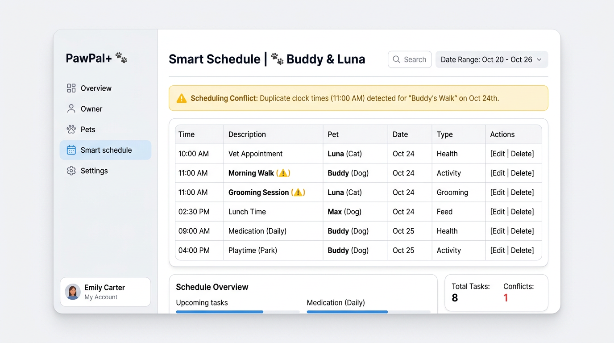

# PawPal+

**PawPal+** is a small pet-care planning app: it helps an owner track tasks per pet, view a **time-ordered** schedule for any date, **filter** by pet or completion status, see **conflict warnings** when two incomplete tasks share the same clock time, and **roll recurring tasks forward** after completion (`daily` / `weekly`).

The **domain model** lives in `pawpal_system.py` (**Owner → Pet → Task**, plus **Scheduler**). The **Streamlit UI** (`app.py`) calls the scheduler so users see that behavior, not a raw task dump.



## Features

| Area | What it does |
|------|----------------|
| **Pets & tasks** | Add pets (name, species, age). Add tasks with description, clock time, due date, frequency (`once` / `daily` / `weekly`). |
| **Sort by time** | `Scheduler.sort_by_time` orders tasks by `due_date`, then `HH:MM`. |
| **Filter** | Choose date, optional pet, and status (all / incomplete / completed). Uses `Scheduler.filter_tasks`. |
| **Conflicts** | `Scheduler.detect_time_conflicts` on incomplete tasks for the selected date; UI shows `st.error` / `st.warning` when two tasks share the same time. |
| **Recurring** | `Pet.mark_task_complete` marks done and, for daily/weekly, appends the next occurrence with an updated `due_date`. |
| **CLI demo** | `python main.py` — scripted walkthrough (sorting, filter samples, recurrence, conflicts). |
| **Tests** | `python -m pytest` — sorting, recurrence, conflicts, filters, empty-pet edge cases. |

## Architecture

- **`UML.md`** — Mermaid class diagram aligned with the code.
- **`uml_final.png`** / **`assets/uml_final.png`** — diagram image for slides or reports.
- **`docs/uml_final.mmd`** — Mermaid source; regenerate the PNG with [Mermaid CLI](https://github.com/mermaid-js/mermaid-cli):  
  `npx @mermaid-js/mermaid-cli -i docs/uml_final.mmd -o uml_final.png`

## How to run

**Install**

```bash
python -m venv .venv
source .venv/bin/activate   # Windows: .venv\Scripts\activate
pip install -r requirements.txt
```

**Web app**

```bash
streamlit run app.py
```

**CLI demo**

```bash
python main.py
```

**Tests**

```bash
python -m pytest
```

Use `python -m pytest -v` for verbose test names.

## Testing PawPal+

Automated tests in `tests/test_pawpal.py` cover:

- Task **sorting** (14:00 / 08:00 / 09:30 → chronological order).
- **Recurring** daily task completion (next `due_date` = +1 day).
- **Conflict detection** (same clock time across pets).
- **Filtering** by `pet_name` and `completed`.
- **Edge cases** (pet with no tasks; basic `mark_complete` / `add_task`).

**Confidence: ★★★★☆** — Core scheduling paths are tested. Overlapping **intervals** (not exact same `HH:MM`) are out of scope for this lightweight model.

## Project layout

| Path | Role |
|------|------|
| `pawpal_system.py` | `Task`, `Pet`, `Owner`, `Scheduler` |
| `app.py` | Streamlit UI, session state, scheduler-driven views |
| `main.py` | Terminal demo |
| `tests/test_pawpal.py` | Pytest suite |
| `reflection.md` | Design notes, tradeoffs, AI collaboration |

## Scenario (course brief)

A busy owner wants help staying consistent with walks, feeding, meds, and grooming. PawPal+ focuses on a clear daily view, simple conflict hints, and recurring tasks—not a full calendar product.
