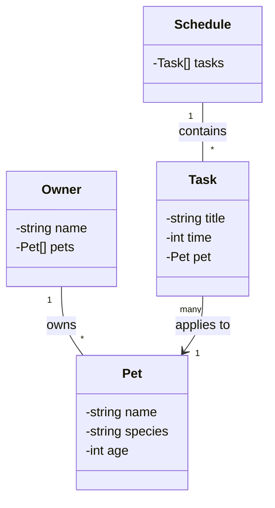

# PawPal+ Development Step Records

## Step 1: Class Diagram Design

### UML Class Diagram

### Class Relationships

- **Owner** owns multiple **Pets** (1-to-many relationship)
- **Task** applies to a specific **Pet** (many-to-one relationship)
- **Schedule** contains multiple **Tasks** (1-to-many relationship)

### Attributes

- **Pet**: name (string), species (string), age (int)
- **Task**: title (string), time (int), pet (Pet reference)
- **Owner**: name (string), pets (Pet array)
- **Schedule**: tasks (Task array)
