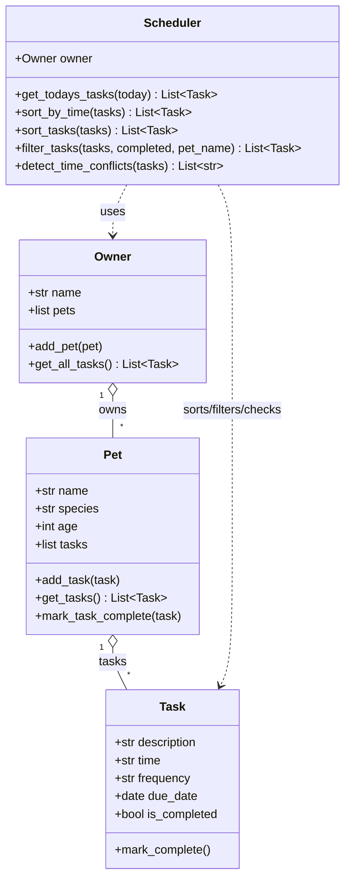

# PawPal+ UML (final — matches `pawpal_system.py`)

Phase 1 used a simpler sketch (tasks owned by a separate `Schedule` class). The shipped design uses **`Scheduler`** with an **`Owner`**, tasks live on **`Pet`**, and **`Task`** carries calendar fields.

## Class diagram (Mermaid)

## Relationships (summary)

| Relationship | Meaning |
|--------------|---------|
| **Owner → Pet** | One owner has many pets. |
| **Pet → Task** | Each task instance belongs to one pet’s list (`Pet.tasks`). |
| **Scheduler → Owner** | Scheduler reads tasks via `Owner.get_all_tasks()` (aggregates all pets). |
| **Scheduler → Task** | No ownership; scheduler orders/filters/conflict-checks task lists. |

## Exported image

PNG copies: **`uml_final.png`** (repo root) and **`assets/uml_final.png`**. Regenerate from **`docs/uml_final.mmd`** with [Mermaid CLI](https://github.com/mermaid-js/mermaid-cli):  
`npx @mermaid-js/mermaid-cli -i docs/uml_final.mmd -o uml_final.png`
