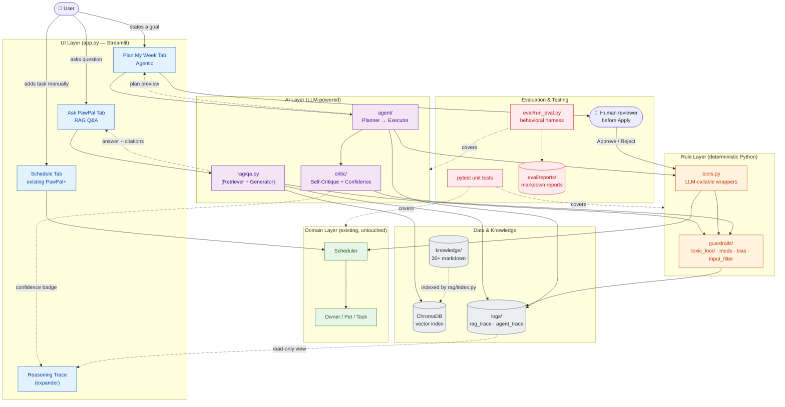
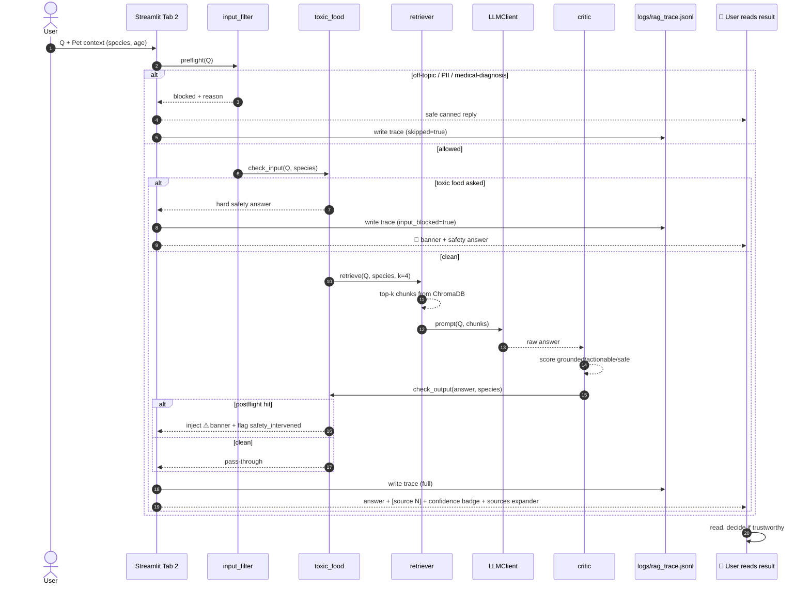
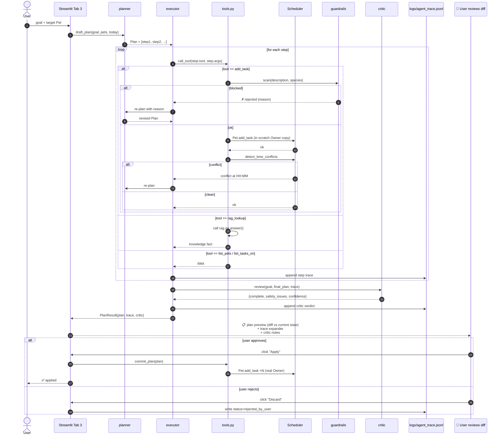
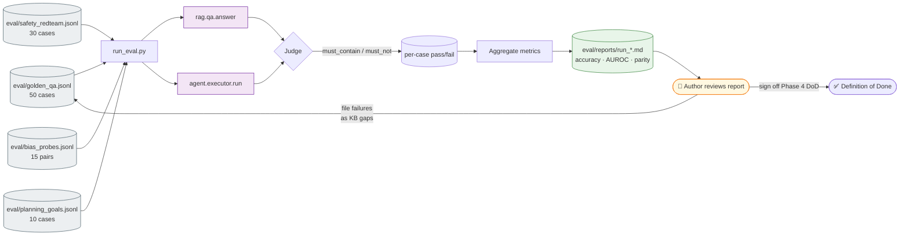
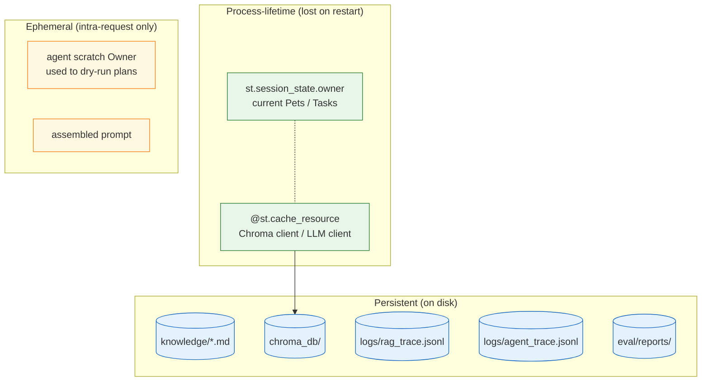
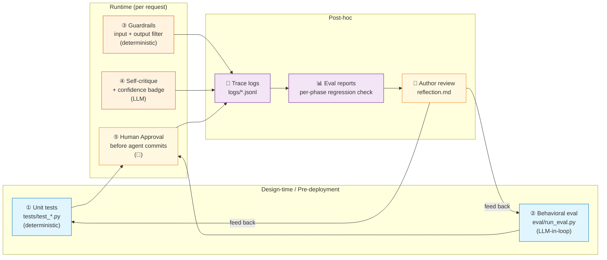

# Design & Architecture — How PawPal AI Fits Together

> **Status**: Draft v1.1 (Phase 3 ✅ implemented — critic / confidence / bias / red-team)
> **Scope**: The complete target system (covers everything planned for Phases 1–4)
> **Companion docs**:
> - `docs/design/initial.md` — overall plan and extension directions
> - `docs/plan/phase1.md` … `phase4.md` — Phase 1–4 implementation steps
> - `docs/design/open_questions.md` — 5 unresolved design questions
>
> This doc answers the three questions in the assignment's "Design and Architecture" section:
> 1. What are the main components?
> 2. How does data flow (input → process → output)?
> 3. Where do humans / tests verify AI results?
>
> Phase 3 status: critic + confidence + bias_filter + 4 eval sections
> are all implemented and wired into the RAG and Agent main paths; the UI now shows a confidence badge
> and applies the §3.5 guardrail-vs-critic priority rule. Phase 4 only has "run the
> full eval with a real LLM, write the final reflection, and lock down the PNG diagrams" left.
>
> 📸 **PNG mirror**: every mermaid diagram below is also exported under [`diagrams/`](diagrams/),
> committed to git. In viewers that don't render mermaid (Cursor preview, IDE preview,
> Pandoc-PDF, etc.), just click the PNG link:
> [system_overview](diagrams/system_overview.png) · [flow_rag](diagrams/flow_rag.png)
> · [flow_agent](diagrams/flow_agent.png) · [flow_eval](diagrams/flow_eval.png)
> · [state_layers](diagrams/state_layers.png) · [testing_checkpoints](diagrams/testing_checkpoints.png).
> Regeneration commands are in [`diagrams/README.md`](diagrams/README.md).

---

## 1. The Whole System at a Glance (high-level component diagram)



**How to read this diagram**:
- Blue = UI layer (user interaction)
- Purple = AI layer (non-deterministic, requires prompt engineering)
- Orange = Rule layer (deterministic Python — guardrails and tool wrappers)
- Green = Domain layer (existing PawPal+ code, untouched)
- Gray = data / knowledge / logs
- Red = tests / evaluation / human checkpoints

**Core design principle**: the AI layer can never reach the domain layer without going through the rule layer first (→ every arrow from purple to green in the diagram is intercepted by orange).

---

## 2. Main Components — What Each One Does

| Component | Type | Responsibility | Input | Output |
|------|------|------|------|------|
| **`pawpal/rag/index.py`** | utility script | chunks `knowledge/*.md`, embeds, and writes to ChromaDB | markdown files | vector index |
| **`pawpal/rag/retrieve.py`** | Retriever | given a query, returns the top-k relevant chunks | `query, species, k` | `list[Chunk]` |
| **`pawpal/rag/qa.py`** | RAG Generator | retrieve → prompt → LLM → guardrail → log | `query, pet_context` | `AnswerResult(text, sources, safety_flag)` |
| **`agent/planner.py`** | Planner | breaks a user goal into a tool-call plan | `user_goal, pet_context` | `Plan(steps=[...])` |
| **`agent/executor.py`** | Executor | runs the plan step-by-step, falls back to the planner on conflict | `Plan` | `Trace` + commit suggestion |
| **`critic/self_critique.py`** | Critic | scores an answer / plan on grounded / actionable / safe | answer + context | `CriticReport` |
| **`critic/confidence.py`** | Aggregator | aggregates the three scores into a 0..1 confidence | `CriticReport` | `float` |
| **`pawpal/guardrails/toxic_food.py`** | rule | toxic-food blocklist + input/output scanning | text + species | `list[Hit]` |
| **`pawpal/guardrails/dangerous_meds.py`** | rule | dangerous medication keyword detection | text | `list[Hit]` |
| **`pawpal/guardrails/bias_filter.py`** | rule | detects signs of "species bias" (e.g. small pets get overly short answers) | answer + meta | `list[Warning]` |
| **`pawpal/guardrails/input_filter.py`** | rule | blocks off-topic / PII / medical-diagnosis requests | query | `(allowed, reason)` |
| **`pawpal/tools.py`** | adapter | wraps `Pet`/`Scheduler` as LLM function-calling interfaces | structured args | structured result |
| **`pawpal/domain.py`** | domain | `Owner` / `Pet` / `Task` / `Scheduler` (existing) | — | — |
| **`eval/run_eval.py`** | evaluator | runs the 4 jsonl datasets and emits a markdown report | jsonl files | `eval/reports/run_*.md` |
| **`tests/*`** | unit tests | pytest coverage for rules + domain + tool adapters | — | pass/fail |

> **Key invariants (re-check during Phase 4 acceptance)**:
> - Any LLM output **passes through at least one** `pawpal/guardrails/*.scan_text()` before being shown to the user.
> - Any `add_task` **must** go through `pawpal.tools.add_task()` before being written to `Pet.tasks`, and `pawpal.tools.add_task` internally forces a call to `pawpal.guardrails.toxic_food.scan_text`.
> - Every LLM call must write a trace to `logs/`.

---

## 3. Data Flow (input → process → output)

The system has **3 main data flows**, one per user intent.

### 3.1 Flow A — RAG knowledge Q&A ("Ask PawPal")

> **Intent**: the user asks a factual pet-care question ("Can I feed my dog grapes?")



**Key checkpoints (in the diagram)**:
- Step 2: input filter blocks off-topic / PII — **saves tokens + prevents abuse**
- Step 4: input toxic-food block — **saves an LLM call + 100% safe**
- Steps 9–12: critic scores before the guardrail and writes the trace at the same time
- Step 15: the UI always shows answer + citations + confidence + an expandable raw chunk view at once — **so the user can judge for themselves**

---

### 3.2 Flow B — Agentic multi-step planning ("Plan My Week")

> **Intent**: the user gives a goal ("plan Luna's first week"), and the AI calls tools like `Pet.add_task` / `Scheduler.detect_time_conflicts` / `rag.qa.answer`, iterating until it produces a conflict-free plan.



**Key design points**:
- **Plans always run on a "scratch copy" first**, and only commit to real state when the user clicks Apply → the existing schedule can never be corrupted.
- **Re-plans are capped** (max_replans=3, max_steps=10) → prevents infinite loops.
- **Every step is appended to the trace** → hard evidence for explainability.
- **The critic runs before the user sees the plan** → the confidence shown in the UI isn't tacked on after the fact.
- **Human approval is mandatory** → even a 0.99 critic score won't change the owner without a user click on "Apply".

---

### 3.3 Flow C — Evaluation (offline, developer-facing)

> **Intent**: the developer runs a dataset to inspect system accuracy, safety, fairness, and confidence calibration.



**Where humans step in**:
- When designing the jsonl, a human writes the ground truth / must_contain / must_not_contain.
- After a run, a human reads the markdown report and decides which failures are false negatives vs. real bugs.
- Failure cases get fed back into the knowledge base (add markdown) or the prompt (tighten constraints).

---

## 4. State Management

### 4.1 State Layers



**Design trade-offs**:
- **No database in Phases 1–3** — `Owner` lives in `st.session_state` (consistent with the existing PawPal+), which keeps complexity down.
- **Phase 4 stretch** is when we'd consider persisting `Owner` to SQLite.
- **Traces are the only "AI behavior records" that survive across sessions** — both the demo and the reflection rely on them.

### 4.2 Safe-commit pattern (Agentic path only)

```
agent.executor always runs on the "scratch Owner" first
       │
       ▼
critic scores + result is shown to the user
       │
       ▼
   user click "Apply"?
   ┌───┴───┐
  YES     NO
   │       │
   ▼       ▼
commit  discard + log "rejected_by_user"
into st.session_state.owner
```

**Why we do this**: it stops an LLM bug from contaminating the user's existing schedule — the 50 tasks already on file won't get a flood of garbage tasks added because of one failed plan.

---

## 5. Where Humans / Tests Verify AI Results

> The third assignment question targets exactly this — the answer is "**5 checkpoints, spanning design-time, runtime, and post-hoc**".



| # | Checkpoint | Type | Owner | What it catches |
|---|--------|------|--------|----------|
| ① | Unit tests | automated / design-time | `pytest` (CI-friendly) | regression bugs in the rule + domain layers |
| ② | Behavioral eval | semi-automated / pre-deploy | `eval/run_eval.py` + human report review | accuracy regressions, KB gaps, bias, confidence drift |
| ③ | Guardrails | automated / runtime | deterministic code in `pawpal/guardrails/*` | toxic foods, dangerous meds, PII, off-topic |
| ④ | Self-critique | automated / runtime | second-pass LLM in `critic/*` | missing citations, vague advice, safety risks |
| ⑤ | Human approval | manual / runtime | end user | LLM-generated plans must be reviewed before commit |
| 📂 | Trace logs | passive / post-hoc | developer grep | anomalies / edge cases / token usage |
| 📊 | Eval reports | active / post-hoc | author review | phase-to-phase regressions, bias trends |

**Key observations**:
- **No LLM output can skip ③** — this is the "non-bypassable hard guardrail".
- **Any write operation (add_task / commit plan) must go through ⑤** — even with a perfect critic score.
- ② and 📊 form a closed loop: each phase runs them at completion, and a score drop blocks the merge.

---

## 6. Component Contracts (interface stability)

To keep phases from clashing, the interfaces below **are frozen** once Phase 1 lands (only backward-compatible extensions allowed):

| Interface | Signature (pseudocode) | Frozen since |
|------|----------------|----------|
| `LLMClient.chat` | `chat(messages, model, **kw) -> str` | Phase 1 |
| `LLMClient.embed` | `embed(texts, model) -> list[list[float]]` | Phase 1 |
| `rag.qa.answer` | `answer(query, pet_context) -> AnswerResult` | Phase 1 |
| `tools.add_task` | `add_task(pet_name, description, time, frequency, due_date) -> Result` | Phase 1 |
| `tools.detect_conflicts` | `detect_conflicts(date_iso) -> list[str]` | Phase 1 |
| `guardrails.toxic_food.scan_text` | `scan_text(text, species) -> list[Hit]` | Phase 1 |
| `agent.executor.run` | `run(goal, pet_name) -> PlanResult` | Phase 2 |
| `critic.self_critique.review` | `review(answer, context) -> CriticReport` | Phase 3 |

**Pydantic models** are centralized in `models.py` (created in Phase 1); every cross-component data structure uses them so dicts can't drift:

```python
class AnswerResult(BaseModel):
    text: str
    sources: list[Citation]
    safety_intervened: bool
    confidence: float | None  # populated starting in Phase 3
    retrieved_chunks: list[Chunk]

class Plan(BaseModel):
    goal: str
    steps: list[PlanStep]
    version: int  # +1 on every re-plan

class PlanResult(BaseModel):
    plan: Plan
    trace: list[StepTrace]
    critic: CriticReport
    status: Literal["preview", "applied", "rejected"]
```

---

## 7. Cross-cutting concerns

| Concern | How | Where |
|--------|--------|--------|
| **Logging** | every LLM call + every guardrail hit writes JSONL | `logs/rag_trace.jsonl`, `logs/agent_trace.jsonl` |
| **Error handling** | `LLMClient` retries 3 times internally (exponential backoff), and final failure is converted into `AnswerResult(safety_intervened=True, text="Service temporarily unavailable, please try again later")` | `pawpal/llm_client.py` |
| **Secrets** | `.env` + `python-dotenv`, **never committed**; `.gitignore` enforces it | repo root |
| **Reproducibility** | `requirements.txt` pins versions; `temperature=0.2`; prompt templates are centralized in `agent/prompts.py` | multiple places |
| **Cost control** | `gpt-4o-mini` + `text-embedding-3-small`; skip the LLM when input hits a guardrail; cache retrievals | `pawpal/llm_client.py` |
| **Observability** | trace expander is visible directly in the UI; `eval/reports/` is markdown-readable | UI + `eval/` |

---

## 8. How Phases Map to This Architecture

| Phase | New pieces added in this architecture | Corresponding assignment milestone | Status |
|-------|----------------------|---------------------|------|
| **Phase 1** | `pawpal/rag/`, `pawpal/guardrails/toxic_food`, `pawpal/guardrails/input_filter`, `pawpal/tools.py`, `pawpal/llm_client.py`, "Ask PawPal" tab, `logs/rag_trace.jsonl`, golden QA eval | RAG MVP + 1 guardrail | ✅ |
| **Phase 2** | `pawpal/agent/{models,prompts,planner,executor}`, 5-tool expansion of `pawpal/tools.py`, "Plan My Week" tab, `logs/agent_trace.jsonl`, scratch-Owner commit pattern, planning_goals eval | Agentic loop | ✅ |
| **Phase 3** | `pawpal/critic/self_critique`, `pawpal/critic/confidence`, confidence badge UI, AUROC calibration report, `pawpal/guardrails/bias_filter`, bias_probes eval | Self-critique + Bias |
| **Phase 4** | full `eval/run_eval.py`, `docs/REFLECTION_v2.md`, demo video / slides, optional SQLite persistence | Evaluation + docs + demo |

Each phase's design doc (`docs/plan/phase{1..4}.md`) **back-references** the matching section here to prevent design drift.

---

## 9. Identified Design Risks

| Risk | Mitigation | Verification |
|------|------|------|
| LLM doesn't cite using `[source N]` → explainability breaks | strict prompt constraint + post-processing regex; missing citation = confidence -= 0.3 | `eval/golden_qa` checks for must_contain `[source` |
| Agent infinite loop (reaches max_steps but never commits) | hard limit in the executor + immediate exit when critic.complete=false | `eval/planning_goals` requires 100% to finish in ≤ 10 steps |
| Critic gives inflated scores (grade inflation) | compute AUROC against golden QA; if < 0.7, switch to self-consistency multi-sampling | Phase 3 acceptance requires AUROC ≥ 0.75 |
| Streamlit session_state out of sync with the scratch Owner | always deepcopy; commits do whole-object replacement, never incremental patches | unit test `test_commit_does_not_mutate_owner_until_apply` |
| Blocklist coverage gaps (newly emerging dangerous foods) | blocklist + post-hoc LLM safety check as double insurance; quarterly review | `eval/safety_redteam` monitored across phases |

---

## 10. One-line Summary

> **PawPal AI = (existing domain layer + deterministic hard guardrails in the rule layer) + (three LLM modules: RAG retrieval + Agentic planning + Self-critique) + (a five-checkpoint closed-loop verification)**.
> Data flows in one direction: User → UI → AI module → rule layer → domain layer; every step on the way back writes a trace, attaches citations, passes a guardrail, and any write operation requires human approval.
