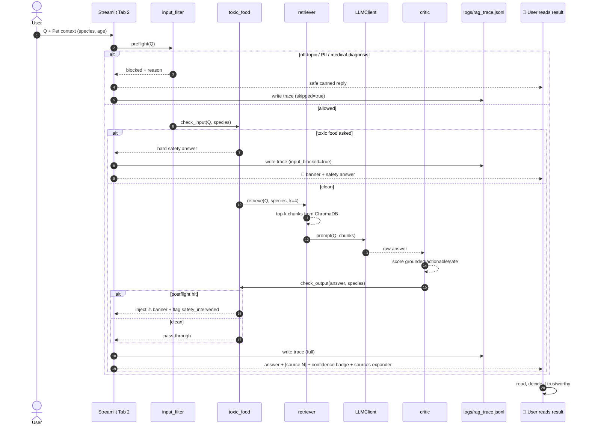
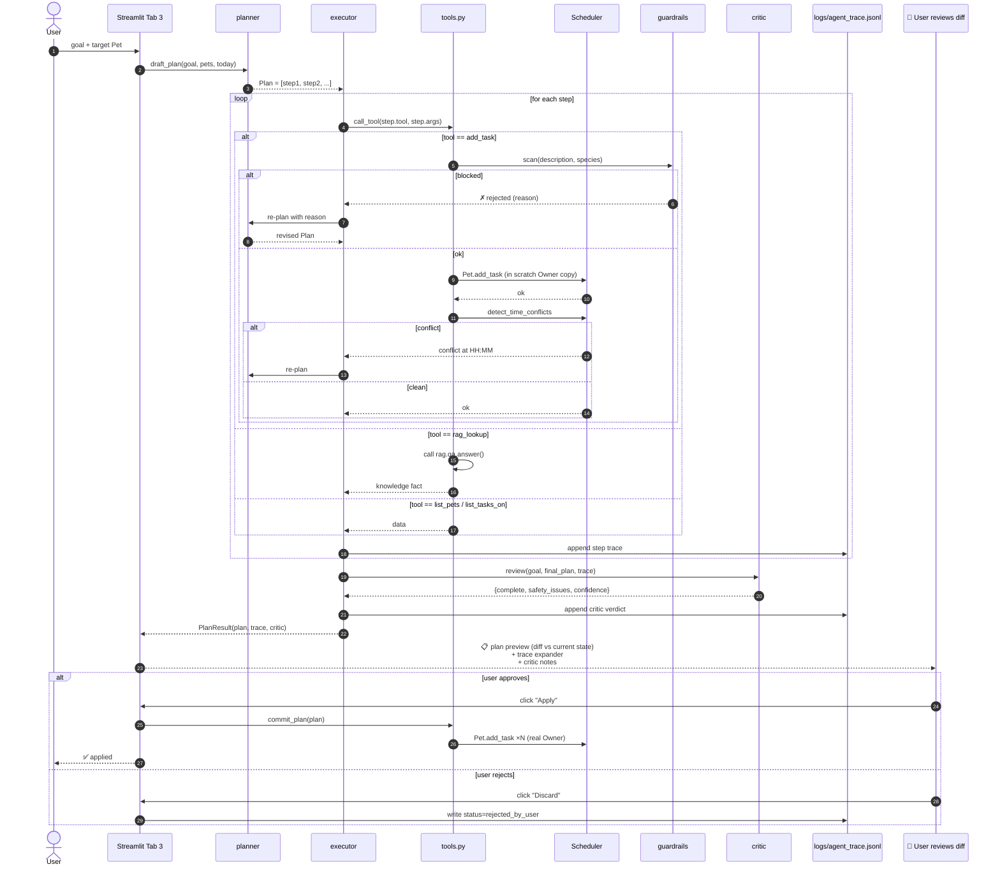
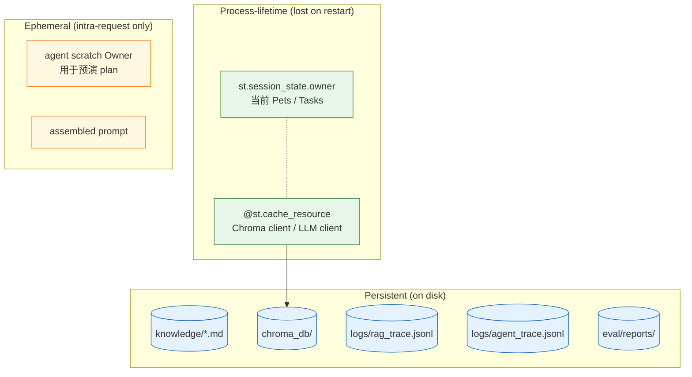
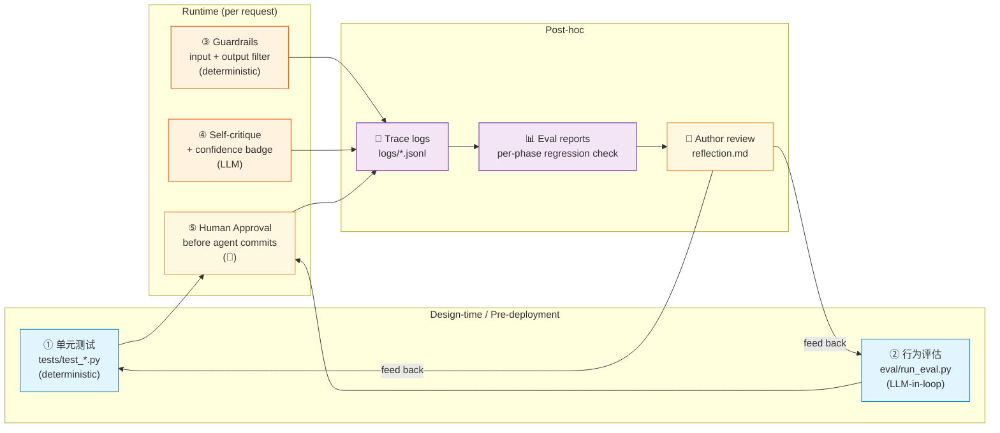

# Design & Architecture — How PawPal AI Fits Together

> **Status**: Draft v1.1 (Phase 3 ✅ implemented — critic / confidence / bias / red-team)
> **Scope**: 完整目标系统（涵盖 Phase 1–4 的全部计划）
> **配套文档**:
> - `docs/design/initial.md` — 总体计划与扩展方向
> - `docs/plan/phase1.md` … `phase4.md` — Phase 1–4 落地步骤
> - `docs/design/open_questions.md` — 5 个未决设计问题
>
> 本文档回答作业 "Design and Architecture" 章节的三个问题：
> 1. 主要组件有哪些？
> 2. 数据如何流动（input → process → output）？
> 3. 人 / 测试在哪些环节验证 AI 的结果？
>
> Phase 3 现状：critic + confidence + bias_filter + 4 个 eval section
> 全部已实施并落入 RAG 与 Agent 主链路；UI 已加入 confidence badge
> 与 §3.5 的 guardrail-vs-critic 优先级规则。Phase 4 仅剩"用真实 LLM
> 跑完整 eval、写最终 reflection、固化 PNG 图"。
>
> 📸 **PNG 镜像**: 下面所有 mermaid 图都同步导出在 [`diagrams/`](diagrams/)，
> commit 进 git。在不渲染 mermaid 的 viewer（Cursor 预览、IDE preview、
> Pandoc-PDF 等）里直接点 PNG 链接看：
> [system_overview](diagrams/system_overview.png) · [flow_rag](diagrams/flow_rag.png)
> · [flow_agent](diagrams/flow_agent.png) · [flow_eval](diagrams/flow_eval.png)
> · [state_layers](diagrams/state_layers.png) · [testing_checkpoints](diagrams/testing_checkpoints.png)。
> 再生成命令见 [`diagrams/README.md`](diagrams/README.md)。

---

## 1. 一图看懂整个系统（高层组件图）


**怎么读这张图**：
- 蓝色 = UI 层（用户交互）
- 紫色 = AI 层（不确定性、需要 prompt 工程）
- 橙色 = 规则层（确定性 Python，guardrails 和 tool wrappers）
- 绿色 = 领域层（现有 PawPal+ 代码，不改）
- 灰色 = 数据 / 知识 / 日志
- 红色 = 测试 / 评估 / 人工检查点

**核心设计原则**：AI 层永远要经过规则层才能触达领域层（→ 图里所有从紫色到绿色的箭头都被橙色拦截）。

---

## 2. 主要组件 — 各自的职责

| 组件 | 类型 | 职责 | 输入 | 输出 |
|------|------|------|------|------|
| **`pawpal/rag/index.py`** | 工具脚本 | 把 `knowledge/*.md` 切片 + embed + 写 ChromaDB | markdown 文件 | 向量索引 |
| **`pawpal/rag/retrieve.py`** | Retriever | 给定 query，返回 top-k 相关 chunk | `query, species, k` | `list[Chunk]` |
| **`pawpal/rag/qa.py`** | RAG Generator | retrieve → prompt → LLM → guardrail → log | `query, pet_context` | `AnswerResult(text, sources, safety_flag)` |
| **`agent/planner.py`** | Planner | 把用户目标拆成一个 tool-call 计划 | `user_goal, pet_context` | `Plan(steps=[...])` |
| **`agent/executor.py`** | Executor | 按计划顺序调 tool，遇冲突回到 planner | `Plan` | `Trace` + 提交建议 |
| **`critic/self_critique.py`** | Critic | 给一个回答 / 计划打 grounded / actionable / safe 三分 | answer + context | `CriticReport` |
| **`critic/confidence.py`** | Aggregator | 把三分加权成 0..1 置信度 | `CriticReport` | `float` |
| **`pawpal/guardrails/toxic_food.py`** | 规则 | toxic-food 黑名单 + 输入/输出扫描 | text + species | `list[Hit]` |
| **`pawpal/guardrails/dangerous_meds.py`** | 规则 | 危险用药关键词检测 | text | `list[Hit]` |
| **`pawpal/guardrails/bias_filter.py`** | 规则 | 检测「物种偏置」迹象（小宠物回答过短等） | answer + meta | `list[Warning]` |
| **`pawpal/guardrails/input_filter.py`** | 规则 | 离题 / PII / 医疗诊断请求拦截 | query | `(allowed, reason)` |
| **`pawpal/tools.py`** | 适配层 | 把 `Pet`/`Scheduler` 包装成 LLM function-calling 接口 | structured args | structured result |
| **`pawpal/domain.py`** | 领域 | `Owner` / `Pet` / `Task` / `Scheduler`（现有） | — | — |
| **`eval/run_eval.py`** | 评估器 | 跑 4 个 jsonl 数据集，输出 markdown 报告 | jsonl 文件 | `eval/reports/run_*.md` |
| **`tests/*`** | 单元测试 | pytest 覆盖规则 + 领域 + tool 适配 | — | pass/fail |

> **关键 invariant（Phase 4 验收要复查）**：
> - 任何 LLM 输出在显示给用户之前，**至少经过一次** `pawpal/guardrails/*.scan_text()`
> - 任何 `add_task` 在写入 `Pet.tasks` 之前，**必须** 走 `pawpal.tools.add_task()`，而 `pawpal.tools.add_task` 内部强制调用 `pawpal.guardrails.toxic_food.scan_text`
> - 任何 LLM 调用必须写一条 trace 到 `logs/`

---

## 3. 数据流（input → process → output）

系统有 **3 条主要数据流**，分别对应三种用户意图。

### 3.1 流 A — RAG 知识问答（"Ask PawPal"）

> **意图**: 用户问一个宠物护理事实问题（"我能给狗吃葡萄吗？"）



**关键检查点（图中）**：
- 步骤 2：input filter 拦截离题/PII —— **省 token + 防滥用**
- 步骤 4：输入 toxic-food 拦截 —— **省 LLM 调用 + 100% 安全**
- 步骤 9-12：critic 在 guardrail 之前打分，同步写 trace
- 步骤 15：UI 总是同时显示答案 + 引用 + confidence + 可展开的原始 chunk —— **让用户自己判断**

---

### 3.2 流 B — Agentic 多步规划（"Plan My Week"）

> **意图**: 用户给一个目标（"给 Luna 排第一周日程"），AI 调用 `Pet.add_task` / `Scheduler.detect_time_conflicts` / `rag.qa.answer` 等 tool，迭代生成一个不冲突的计划。



**关键设计点**：
- **Plan 永远先在「scratch copy」上执行**，用户点 Apply 才提交真实状态 → 永远不会破坏现有日程
- **Re-plan 有上限**（max_replans=3, max_steps=10）→ 防死循环
- **每一步都进 trace** → 可解释性硬证据
- **critic 在用户看到 plan 之前先跑** → UI 上的 confidence 不是事后补的
- **人工审批是 mandatory** → 即便 critic 给 0.99 分，没有 user click "Apply" 也不会改 owner

---

### 3.3 流 C — 评估（offline，开发者用）

> **意图**: 开发者跑一个数据集，看系统准确率、安全率、公平性、置信度校准。


**人介入的位置**：
- 设计 jsonl 时人工写 ground truth / must_contain / must_not_contain
- 跑完之后人工读 markdown 报告，判断哪些 fail 是 false negative、哪些是真 bug
- 失败案例反馈到知识库（补 markdown）或 prompt（改约束）

---

## 4. 状态管理

### 4.1 状态分层



**设计取舍**：
- **Phase 1–3 不引入数据库** —— `Owner` 用 `st.session_state` 即可（与现有 PawPal+ 一致），降低复杂度
- **Phase 4 stretch** 才考虑把 `Owner` 持久化到 SQLite
- **Trace 是唯一跨会话保留的「AI 行为记录」** —— 演示和 reflection 都靠它

### 4.2 安全 commit 模式（Agentic 路径专用）

```
agent.executor 永远先在「scratch Owner」上执行
       │
       ▼
critic 评分 + 显示给用户
       │
       ▼
   user click "Apply"?
   ┌───┴───┐
  YES     NO
   │       │
   ▼       ▼
commit  discard + log "rejected_by_user"
into st.session_state.owner
```

**为什么这么做**：避免 LLM bug 直接污染用户已有日程 —— 现有的 50 个任务不会因为一次 plan 失败而被 add 一堆乱七八糟的东西。

---

## 5. 人 / 测试在哪里检查 AI 结果

> 作业第三个问题专门问这个 —— 答案是「**5 个检查点，从设计期到运行期到事后**」。



| # | 检查点 | 类型 | 谁负责 | 拦截什么 |
|---|--------|------|--------|----------|
| ① | 单元测试 | 自动 / 设计期 | `pytest`（CI 友好） | 规则层 + 领域层的回归 bug |
| ② | 行为评估 | 半自动 / 部署前 | `eval/run_eval.py` + 人工读报告 | 准确率下降、知识库缺口、bias、置信度漂移 |
| ③ | Guardrails | 自动 / 运行时 | `pawpal/guardrails/*` 确定性代码 | toxic foods、危险用药、PII、离题 |
| ④ | Self-critique | 自动 / 运行时 | `critic/*` LLM 二轮 | 引用缺失、advice 太泛、安全风险 |
| ⑤ | 人工 Approval | 人工 / 运行时 | 终端用户 | LLM 生成的 plan 在 commit 前必看 |
| 📂 | Trace logs | 被动 / 事后 | 开发者 grep | 异常 / 边界案例 / token 消耗 |
| 📊 | Eval 报告 | 主动 / 事后 | 作者 review | phase-to-phase 回归、bias 趋势 |

**关键观察**：
- **没有任何一个 LLM 输出能跳过 ③** —— 这是「不可绕过的硬护栏」
- **任何写操作（add_task / commit plan）必须经过 ⑤** —— 即便 critic 给满分
- ② 和 📊 形成闭环：每个 phase 完工时跑一遍，分数下降即拒绝合并

---

## 6. 组件契约（接口稳定性）

为了让 phase 之间不打架，下列接口在 Phase 1 落地后**不再修改**（只能向后兼容地扩展）：

| 接口 | 签名（伪代码） | 稳定起点 |
|------|----------------|----------|
| `LLMClient.chat` | `chat(messages, model, **kw) -> str` | Phase 1 |
| `LLMClient.embed` | `embed(texts, model) -> list[list[float]]` | Phase 1 |
| `rag.qa.answer` | `answer(query, pet_context) -> AnswerResult` | Phase 1 |
| `tools.add_task` | `add_task(pet_name, description, time, frequency, due_date) -> Result` | Phase 1 |
| `tools.detect_conflicts` | `detect_conflicts(date_iso) -> list[str]` | Phase 1 |
| `guardrails.toxic_food.scan_text` | `scan_text(text, species) -> list[Hit]` | Phase 1 |
| `agent.executor.run` | `run(goal, pet_name) -> PlanResult` | Phase 2 |
| `critic.self_critique.review` | `review(answer, context) -> CriticReport` | Phase 3 |

**Pydantic 模型**集中放在 `models.py`（Phase 1 创建），所有跨组件的数据结构都用它，避免 dict 漂移：

```python
class AnswerResult(BaseModel):
    text: str
    sources: list[Citation]
    safety_intervened: bool
    confidence: float | None  # Phase 3 起填
    retrieved_chunks: list[Chunk]

class Plan(BaseModel):
    goal: str
    steps: list[PlanStep]
    version: int  # 每次 re-plan +1

class PlanResult(BaseModel):
    plan: Plan
    trace: list[StepTrace]
    critic: CriticReport
    status: Literal["preview", "applied", "rejected"]
```

---

## 7. 跨切面关注点（Cross-cutting concerns）

| 关注点 | 怎么做 | 在哪里 |
|--------|--------|--------|
| **Logging** | 每个 LLM 调用 + 每个 guardrail 命中写 JSONL | `logs/rag_trace.jsonl`, `logs/agent_trace.jsonl` |
| **Error handling** | `LLMClient` 内部 retry 3 次（指数 backoff），最终失败转成 `AnswerResult(safety_intervened=True, text="服务暂不可用，请稍后")` | `pawpal/llm_client.py` |
| **Secrets** | `.env` + `python-dotenv`，**永不入仓**；`.gitignore` 守住 | repo 根 |
| **Reproducibility** | `requirements.txt` 钉版本；`temperature=0.2`；prompt 模板放 `agent/prompts.py` 集中管理 | 多处 |
| **Cost control** | `gpt-4o-mini` + `text-embedding-3-small`；input 命中 guardrail 时跳过 LLM；retrieval 缓存 | `pawpal/llm_client.py` |
| **Observability** | trace expander 在 UI 直接可见；`eval/reports/` 是 markdown 易读 | UI + `eval/` |

---

## 8. Phase 与本架构的对应关系

| Phase | 本架构图中新增的部分 | 对应作业 milestone | 状态 |
|-------|----------------------|---------------------|------|
| **Phase 1** | `pawpal/rag/`, `pawpal/guardrails/toxic_food`, `pawpal/guardrails/input_filter`, `pawpal/tools.py`, `pawpal/llm_client.py`, "Ask PawPal" tab, `logs/rag_trace.jsonl`, eval golden QA | RAG MVP + 1 条 guardrail | ✅ |
| **Phase 2** | `pawpal/agent/{models,prompts,planner,executor}`, `pawpal/tools.py` 5-tool 扩展, "Plan My Week" tab, `logs/agent_trace.jsonl`, scratch-Owner commit 模式, planning_goals eval | Agentic loop | ✅ |
| **Phase 3** | `pawpal/critic/self_critique`, `pawpal/critic/confidence`, confidence badge UI, AUROC 校准报告, `pawpal/guardrails/bias_filter`, bias_probes eval | Self-critique + Bias |
| **Phase 4** | `eval/run_eval.py` 完整版、`docs/REFLECTION_v2.md`、demo 视频/slides、可选 SQLite 持久化 | 评估 + 文档 + 演示 |

每个 phase 的设计文档（`docs/plan/phase{1..4}.md`）会**反向引用**本文档对应章节，避免设计漂移。

---

## 9. 已识别的设计风险

| 风险 | 缓解 | 验证 |
|------|------|------|
| LLM 不按 `[source N]` 引用 → 可解释性失效 | Prompt 强约束 + 后处理正则；缺失即 confidence -= 0.3 | `eval/golden_qa` 检查 must_contain `[source` |
| Agent 死循环（reach max_steps but never committed） | executor 硬限制 + critic.complete=false 时直接退出 | `eval/planning_goals` 100% 必须 ≤ 10 步 |
| critic 给虚高分（grade inflation） | 用 golden QA 算 AUROC；< 0.7 时改 self-consistency 多采样 | Phase 3 验收 AUROC ≥ 0.75 |
| Streamlit session_state 与 scratch Owner 不同步 | 永远 deepcopy；commit 用整体替换不增量 patch | 单元测试 `test_commit_does_not_mutate_owner_until_apply` |
| 黑名单覆盖不全（新出现的危险食物） | 黑名单 + 后置 LLM 安全 check 双保险；季度 review | `eval/safety_redteam` 跨 phase 监控 |

---

## 10. 一句话总结

> **PawPal AI = (现有领域层 + 规则层确定性硬护栏) + (RAG 检索 + Agentic 规划 + Self-critique 三个 LLM 模块) + (五重检查点闭环验证)**。
> 数据流向是单向的：用户 → UI → AI 模块 → 规则层 → 领域层；返回的每一步都打 trace、附引用、过 guardrail，且任何写操作都需要人工 Approval。
