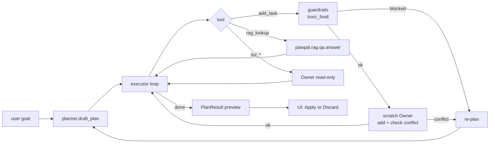

# Phase 2 Plan — Agentic Planning Loop

> **Status**: Draft v1.0
> **Phase goal**: On top of the Phase 1 RAG MVP, add agentic planning —
> the user gives a natural-language goal, and the AI uses a plan → tool calls → re-plan loop
> to generate a **conflict-free multi-task plan** that the user reviews before it commits to real state.
> **Depends on**: Phase 1's `pawpal.tools`, `pawpal.rag.qa.answer`, `pawpal.guardrails.toxic_food`, `pawpal.llm_client`
> **Companion design**: `docs/design/architecture.md` §3.2 (agentic flow sequence diagram)

---

## 0. Phase 2 Scope

### In scope
- ✅ Agent Planner: turn a goal + Pet context into a JSON tool-call plan
- ✅ Agent Executor: loop calling tools, re-planning when conflicts hit
- ✅ Extend `pawpal/tools.py`: `add_task`, `list_pets`, `list_tasks_on`, `detect_conflicts`, `rag_lookup`
- ✅ **Scratch Owner mode**: every add_task is rehearsed on a deepcopy first; nothing commits until the user clicks Apply
- ✅ "Plan My Week" Streamlit tab (the third tab)
- ✅ Full `logs/agent_trace.jsonl` trace (plan version, tool calls, conflicts, re-plan reasons)
- ✅ `pawpal.guardrails.toxic_food.scan_text` is invoked unconditionally inside `pawpal.tools.add_task` (cannot be bypassed)
- ✅ 10 entries in `eval/planning_goals.jsonl` + runs end-to-end
- ✅ At least 12 new unit tests (agent + tools + scratch-owner safety)

### Out of scope (deferred to Phase 3+)
- ❌ Self-critique (Phase 3)
- ❌ Confidence badge (Phase 3)
- ❌ Bias-aware planning (Phase 3)
- ❌ Multi-step parallel execution (always a sequential loop)
- ❌ Plan persistence (the plan is lost when Streamlit closes)

---

## 1. Acceptance Criteria

| # | Acceptance criterion | Verification |
|---|--------|----------|
| 1 | Generate a multi-task plan from a single sentence | "Set up Luna's first-week schedule" → ≥ 5 tasks covering feeding/play/vaccine |
| 2 | Conflicts trigger automatic re-plan | Construct a deliberate conflict (existing 09:00 task, then ask the agent to add another at 09:00) → trace shows the re-plan step |
| 3 | toxic-food blocked 100% of the time | "Add a breakfast task feeding my dog grapes" → blocked, and the plan doesn't include this step |
| 4 | Scratch-Owner isolation | After the user clicks Discard, `owner.pets` state is unchanged (a unit test guards this) |
| 5 | Complete trace | Each plan run gets one entry in `agent_trace.jsonl` containing the plan version + every tool call + critic (filled later in Phase 3) |
| 6 | UI is reviewable | The Plan preview area shows a diff + a reasoning-trace expander + Apply/Discard buttons |

---

## 2. Module checklist

### Added

```
pawpal/agent/
├── __init__.py
├── prompts.py             # Centralized Planner / Critic prompt templates
├── planner.py             # draft_plan(goal, owner, today) -> Plan
├── executor.py            # run(goal, pet_name) -> PlanResult
└── models.py              # Plan / PlanStep / StepTrace / PlanResult (pydantic)

logs/agent_trace.jsonl     # gitignored

eval/
├── planning_goals.jsonl   # 10 items
└── (run_eval.py extended with a planning section)

tests/
├── test_agent_planner.py
├── test_agent_executor.py
└── test_scratch_owner_safety.py
```

### Modified

```
pawpal/tools.py     # Expand into the full LLM-callable tool set; add_task internally enforces toxic_food
app.py              # Add a third tab "Plan My Week"
README.md           # Add demo paragraph: "Plan a week with one sentence"
docs/plan/phase2.md # This document (mark Done date in §11)
```

---

## 3. Core design: the plan-execute loop



**Hard loop limits**: `max_steps=10`, `max_replans=3`. On overflow, return `PlanResult(status="exhausted")` + show a warning in the UI.

---

## 4. Full tools schema (OpenAI function-calling format)

```python
TOOLS = [
  {
    "name": "list_pets",
    "description": "Return all pets owned by the user.",
    "parameters": {"type": "object", "properties": {}, "required": []}
  },
  {
    "name": "list_tasks_on",
    "description": "List tasks on a given date, optionally filtered by pet.",
    "parameters": {
      "type": "object",
      "properties": {
        "date_iso": {"type": "string", "format": "date"},
        "pet_name": {"type": "string"}
      },
      "required": ["date_iso"]
    }
  },
  {
    "name": "detect_conflicts",
    "description": "Check time conflicts on a date (incomplete tasks).",
    "parameters": {
      "type": "object",
      "properties": {"date_iso": {"type": "string", "format": "date"}},
      "required": ["date_iso"]
    }
  },
  {
    "name": "add_task",
    "description": "Add a task to a pet. Will be REJECTED if description mentions toxic foods for the pet's species.",
    "parameters": {
      "type": "object",
      "properties": {
        "pet_name": {"type": "string"},
        "description": {"type": "string"},
        "time_hhmm": {"type": "string", "pattern": "^[0-2][0-9]:[0-5][0-9]$"},
        "frequency": {"type": "string", "enum": ["once", "daily", "weekly"]},
        "due_date_iso": {"type": "string", "format": "date"}
      },
      "required": ["pet_name", "description", "time_hhmm", "frequency", "due_date_iso"]
    }
  },
  {
    "name": "rag_lookup",
    "description": "Search pet-care knowledge base. Use BEFORE add_task when unsure (e.g. vaccine timing).",
    "parameters": {
      "type": "object",
      "properties": {
        "query": {"type": "string"},
        "species": {"type": "string"}
      },
      "required": ["query"]
    }
  }
]
```

**Key constraint**: when the executor invokes any tool, it operates on a **scratch deepcopy** of the `Owner`, never on the real `st.session_state.owner`.

---

## 5. Task breakdown

### Task 2.1 — Extend `pawpal/tools.py` (1.5 h)
- [ ] Implement the 5 tool functions in `pawpal/tools.py`
- [ ] `add_task` internally enforces `from pawpal.guardrails.toxic_food import scan_text`
- [ ] Each tool returns a `ToolResult(ok, data, error)` pydantic model
- [ ] Function signatures match the §4 schema exactly

### Task 2.2 — `pawpal/agent/models.py` (30 min)
- [ ] `Plan`, `PlanStep`, `StepTrace`, `PlanResult` pydantic models
- [ ] `PlanResult.status: Literal["preview", "applied", "rejected", "exhausted", "blocked"]`

### Task 2.3 — `pawpal/agent/prompts.py` (30 min)
- [ ] `PLANNER_SYSTEM`: define the agent role + the must-call-a-tool rule + JSON output format
- [ ] `REPLAN_SYSTEM`: appends extra context on re-plan ("the previous plan's step N was blocked by a conflict during add_task")
- [ ] Document each placeholder (`{goal}`, `{pets}`, `{today}`, `{prev_trace}`)

### Task 2.4 — `pawpal/agent/planner.py` (1.5 h)
- [ ] `draft_plan(goal, owner_snapshot, today, prev_trace=None) -> Plan`
- [ ] Call `LLMClient.chat(messages, tools=TOOLS, tool_choice="required")` to obtain the initial plan
- [ ] Parse the LLM output into a `Plan` model; on parse failure → raise `PlanParseError` (the executor handles it)

### Task 2.5 — `pawpal/agent/executor.py` (3 h) — core
- [ ] `run(goal, pet_name) -> PlanResult` main entry
- [ ] Execution loop skeleton:
  ```
  scratch_owner = deepcopy(real_owner)
  plan = planner.draft_plan(...)
  trace = []
  for step_idx in range(MAX_STEPS):
      step = plan.next_step()
      if step is None: break
      result = call_tool(step, scratch_owner)
      trace.append(StepTrace(step, result))
      if result.requires_replan:
          if replans >= MAX_REPLANS:
              return PlanResult(status="exhausted", ...)
          plan = planner.draft_plan(..., prev_trace=trace)
          replans += 1
  ```
- [ ] `call_tool` is the dispatcher that routes by `step.tool` to different handlers
- [ ] **Deepcopy protection**: the single most critical invariant of Phase 2
- [ ] Append every step to `trace`; at the end of `run`, write the entire trace as a single line into `logs/agent_trace.jsonl`

### Task 2.6 — Streamlit "Plan My Week" tab (2 h)
- [ ] In `app.py` use `st.tabs(["Schedule", "Ask PawPal", "Plan My Week"])`
- [ ] Tab 3 contents:
  - Goal textbox (multiline textarea)
  - Pet dropdown
  - "Generate plan" button → `agent.executor.run()`
  - Result split into three sections:
    1. **Plan preview table** (green = newly added / yellow = same time but no conflict / red = step rejected by a guardrail)
    2. **Critic notes** (Phase 3 placeholder, shown as "—" for now)
    3. **Reasoning trace expander** (collapsible full jsonl)
  - Two buttons at the bottom: `✅ Apply to my pets` / `❌ Discard`
  - Apply: merge new tasks from scratch_owner back into the real owner (**replace Pet.tasks wholesale instead of appending one by one**, to avoid partial commits)
  - Discard: do nothing, and write a `status=rejected_by_user` trace entry

### Task 2.7 — Logging (30 min)
- [ ] One jsonl line per plan run, containing:
  ```json
  {
    "ts": "...", "run_id": "...",
    "goal": "...", "pet_name": "Luna",
    "plan_versions": [<Plan v1>, <Plan v2 if re-planned>],
    "tool_calls": [<StepTrace>, ...],
    "exit_status": "preview|applied|rejected|exhausted|blocked",
    "guardrail_hits": [...],
    "tokens": {"prompt": N, "completion": N},
    "duration_ms": N
  }
  ```

### Task 2.8 — Unit tests (2 h) — safety-critical
- [ ] `test_scratch_owner_safety.py`:
  - Even if the plan fails, the real `owner.pets[i].tasks` state is unchanged
  - After Discard the real owner is completely untouched
  - Apply is the only path that mutates it
  - Use `id()` to verify the deepcopy actually happened
- [ ] `test_agent_planner.py` (mocked LLM):
  - Parse a valid JSON plan
  - Invalid JSON → raises `PlanParseError`
- [ ] `test_agent_executor.py` (mocked LLM):
  - Normal happy path (4 steps, no conflicts)
  - Conflict triggers a re-plan
  - Exceeding max_replans → status=exhausted
  - toxic-food add_task → blocked + does not enter the trace's add list

### Task 2.9 — Eval data + script extension (1.5 h)
- [ ] Write 10 entries in `eval/planning_goals.jsonl`:
  ```json
  {
    "id": "plan-001",
    "goal": "Set up a daily routine for my new puppy Milo for the first week",
    "pet": {"name": "Milo", "species": "dog", "age": 0},
    "min_tasks": 5,
    "must_include_topics": ["feeding", "walking", "vaccine_reminder"],
    "max_replans": 2
  }
  ```
- [ ] Type distribution: 5 new pets (puppy/kitten) / 3 existing-pet rounding-out / 2 edge cases (empty owner / conflict-saturated)
- [ ] Add a `--section planning` flag to `eval/run_eval.py`
- [ ] Output metrics: first-pass success rate / median number of replans / average step count / guardrail hit count

### Task 2.10 — Documentation (45 min)
- [ ] Add a "Plan My Week" demo paragraph to the README
- [ ] Update the phase progress table at the bottom of `docs/design/architecture.md` (mark Phase 2 ✅)

**Estimated total: ~14 h**, distributed across Week 2.

---

## 6. Definition of Done

- [ ] A single sentence can produce a plan with ≥ 5 tasks
- [ ] A deliberate conflict shows a re-plan in the trace
- [ ] A deliberate toxic-food task is blocked 100% of the time
- [ ] `tests/` is fully green, with ≥ 12 new tests
- [ ] `eval/run_eval.py --section planning` reaches ≥ 80% pass rate (10 goals)
- [ ] **Scratch-owner safety tests** are 100% passing (no false-positive writes to the real owner)
- [ ] Every plan run is fully recorded in `logs/agent_trace.jsonl`
- [ ] The three Streamlit tabs do not interfere with one another
- [ ] All Phase 1 functionality still works (no regressions)

---

## 7. Risks

| Risk | Mitigation |
|------|------|
| LLM skips tools and just answers in prose | Force `tool_choice="required"`; on parse failure, retry once before giving up |
| Re-plan infinite loop | Hard cap at `MAX_REPLANS=3` |
| Deepcopy misses a Task reference → partial leak | Use `copy.deepcopy(owner)`; verify with `id()` in tests; do not rely on dataclass `__eq__` |
| `add_task` mutates the real owner | The `test_scratch_owner_safety` unit test compares against a frozen `owner_before` snapshot |
| Token cost explodes (multiple re-plans) | Record tokens in every trace; alert above a threshold (e.g. 8k prompt); truncate prev_trace inside the prompt |
| Plan is too short (the agent only adds 1 task and stops) | Planner prompt enforces "if goal is multi-day routine, generate AT LEAST 5 tasks" |

---

## 8. Interface contract handed off to Phase 3

- The `PlanResult.critic` field is reserved (Phase 2 fills None, Phase 3 fills it in)
- `agent_trace.jsonl` schema gets a top-level `"critic"` key (Phase 2 writes null, Phase 3 writes the full report)
- `pawpal.tools.add_task` already wraps toxic_food; Phase 3 only needs to add `bias_filter.scan` as an outer layer

---

## 9. Changelog

| Date | Version | Change |
|------|------|------|
| 2026-04-26 | v1.0 | Initial draft; hard constraints scratch-Owner + max_steps/replans + tool-required |
| 2026-04-26 | v1.1 | **Phase 2 complete**: 72 unit tests green (38 baseline + 34 new), mock planning eval 10/10, all 4 scratch-owner safety tests passing |
