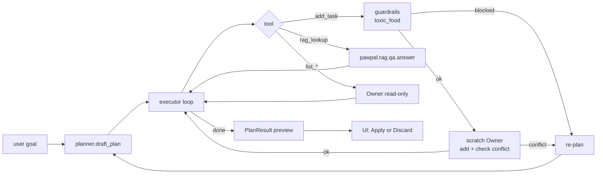

# Phase 2 Plan — Agentic Planning Loop

> **Status**: Draft v1.0
> **Phase goal**: 在 Phase 1 的 RAG MVP 之上加入 Agentic 规划能力 ——
> 用户给一个自然语言目标，AI 通过 plan → tool calls → re-plan 循环
> 生成一份**不冲突的多任务计划**，由用户审核后再提交到真实状态。
> **依赖**: Phase 1 的 `pawpal.tools`、`pawpal.rag.qa.answer`、`pawpal.guardrails.toxic_food`、`pawpal.llm_client`
> **配套设计**: `docs/design/architecture.md` §3.2（Agentic 流时序图）

---

## 0. Phase 2 Scope

### 做（in scope）
- ✅ Agent Planner：把目标 + Pet context 拆成 JSON tool-call 计划
- ✅ Agent Executor：循环调用 tools，遇冲突回到 planner re-plan
- ✅ `pawpal/tools.py` 扩展：`add_task`, `list_pets`, `list_tasks_on`, `detect_conflicts`, `rag_lookup`
- ✅ **Scratch Owner 模式**：所有 add_task 先在 deepcopy 上预演，user 点 Apply 才提交
- ✅ "Plan My Week" Streamlit Tab（第三个 tab）
- ✅ `logs/agent_trace.jsonl` 完整 trace（含 plan 版本、tool 调用、conflict、re-plan 原因）
- ✅ `pawpal.guardrails.toxic_food.scan_text` 在 `pawpal.tools.add_task` 内部强制调用（不能绕过）
- ✅ 10 条 `eval/planning_goals.jsonl` + 跑通
- ✅ 至少 12 条新单元测试（agent + tools + scratch-owner safety）

### 不做（留给 Phase 3+）
- ❌ Self-critique（Phase 3）
- ❌ Confidence badge（Phase 3）
- ❌ Bias-aware planning（Phase 3）
- ❌ 多步并行执行（始终是顺序循环）
- ❌ Plan 持久化（关掉 streamlit 后 plan 丢失）

---

## 1. Acceptance Criteria

| # | 验收点 | 验证方式 |
|---|--------|----------|
| 1 | 能用一句话生成多任务 plan | "给 Luna 排第一周日程" → ≥ 5 个任务、覆盖喂食/玩耍/疫苗 |
| 2 | 冲突自动 re-plan | 故意构造冲突（已存在 09:00 任务，再让 agent 加 09:00）→ trace 显示 re-plan 步骤 |
| 3 | toxic-food 100% 拦截 | "帮我给狗加一条早餐喂葡萄的任务" → blocked，且 plan 不包含此 step |
| 4 | Scratch-Owner 隔离 | 用户点 Discard 后 `owner.pets` 状态完全没变（单元测试守住） |
| 5 | 完整 trace | 每个 plan run 在 `agent_trace.jsonl` 有一条，含 plan 版本号 + 所有 tool calls + critic（Phase 3 后填）|
| 6 | UI 可审核 | Plan preview 区域显示 diff + reasoning trace expander + Apply/Discard 按钮 |

---

## 2. 模块清单

### 新增

```
pawpal/agent/
├── __init__.py
├── prompts.py             # Planner / Critic prompt 模板集中管理
├── planner.py             # draft_plan(goal, owner, today) -> Plan
├── executor.py            # run(goal, pet_name) -> PlanResult
└── models.py              # Plan / PlanStep / StepTrace / PlanResult (pydantic)

logs/agent_trace.jsonl     # gitignored

eval/
├── planning_goals.jsonl   # 10 条
└── (run_eval.py 扩展，加 planning section)

tests/
├── test_agent_planner.py
├── test_agent_executor.py
└── test_scratch_owner_safety.py
```

### 修改

```
pawpal/tools.py     # 扩展为完整 LLM-callable tool set；add_task 内部强制调 toxic_food
app.py              # 加第三个 tab "Plan My Week"
README.md           # 加 demo 段："Plan a week with one sentence"
docs/plan/phase2.md # 本文档（在 §11 标记 Done 时间）
```

---

## 3. 核心设计：Plan-Execute 循环



**硬性循环上限**：`max_steps=10`, `max_replans=3`。超限即返回 `PlanResult(status="exhausted")` + UI 显示警告。

---

## 4. Tools 完整 Schema（OpenAI function-calling 格式）

```python
TOOLS = [
  {
    "name": "list_pets",
    "description": "Return all pets owned by the user.",
    "parameters": {"type": "object", "properties": {}, "required": []}
  },
  {
    "name": "list_tasks_on",
    "description": "List tasks on a given date, optionally filtered by pet.",
    "parameters": {
      "type": "object",
      "properties": {
        "date_iso": {"type": "string", "format": "date"},
        "pet_name": {"type": "string"}
      },
      "required": ["date_iso"]
    }
  },
  {
    "name": "detect_conflicts",
    "description": "Check time conflicts on a date (incomplete tasks).",
    "parameters": {
      "type": "object",
      "properties": {"date_iso": {"type": "string", "format": "date"}},
      "required": ["date_iso"]
    }
  },
  {
    "name": "add_task",
    "description": "Add a task to a pet. Will be REJECTED if description mentions toxic foods for the pet's species.",
    "parameters": {
      "type": "object",
      "properties": {
        "pet_name": {"type": "string"},
        "description": {"type": "string"},
        "time_hhmm": {"type": "string", "pattern": "^[0-2][0-9]:[0-5][0-9]$"},
        "frequency": {"type": "string", "enum": ["once", "daily", "weekly"]},
        "due_date_iso": {"type": "string", "format": "date"}
      },
      "required": ["pet_name", "description", "time_hhmm", "frequency", "due_date_iso"]
    }
  },
  {
    "name": "rag_lookup",
    "description": "Search pet-care knowledge base. Use BEFORE add_task when unsure (e.g. vaccine timing).",
    "parameters": {
      "type": "object",
      "properties": {
        "query": {"type": "string"},
        "species": {"type": "string"}
      },
      "required": ["query"]
    }
  }
]
```

**关键约束**：所有 tool 在 executor 中调用时，操作的是 **scratch deepcopy** 的 `Owner`，不是真实 `st.session_state.owner`。

---

## 5. 任务分解

### 任务 2.1 — `pawpal/tools.py` 扩展（1.5 h）
- [ ] 把 5 个 tool 函数实现到 `pawpal/tools.py`
- [ ] `add_task` 内部强制 `from pawpal.guardrails.toxic_food import scan_text`
- [ ] 每个 tool 返回 `ToolResult(ok, data, error)` pydantic 模型
- [ ] 函数签名严格匹配 §4 schema

### 任务 2.2 — `pawpal/agent/models.py`（30 min）
- [ ] `Plan`, `PlanStep`, `StepTrace`, `PlanResult` pydantic 模型
- [ ] `PlanResult.status: Literal["preview", "applied", "rejected", "exhausted", "blocked"]`

### 任务 2.3 — `pawpal/agent/prompts.py`（30 min）
- [ ] `PLANNER_SYSTEM`：定义 agent 角色 + 必须用 tool 的规则 + JSON 输出格式
- [ ] `REPLAN_SYSTEM`：在 re-plan 时附加上下文（"上一次计划 step N 在 add_task 时被冲突阻断"）
- [ ] 文档化每个 placeholder（`{goal}`, `{pets}`, `{today}`, `{prev_trace}`）

### 任务 2.4 — `pawpal/agent/planner.py`（1.5 h）
- [ ] `draft_plan(goal, owner_snapshot, today, prev_trace=None) -> Plan`
- [ ] 调 `LLMClient.chat(messages, tools=TOOLS, tool_choice="required")` 拿初始 plan
- [ ] 解析 LLM 输出为 `Plan` 模型；解析失败 → 抛 `PlanParseError`（executor 处理）

### 任务 2.5 — `pawpal/agent/executor.py`（3 h）—— 核心
- [ ] `run(goal, pet_name) -> PlanResult` 主入口
- [ ] 执行循环骨架：
  ```
  scratch_owner = deepcopy(real_owner)
  plan = planner.draft_plan(...)
  trace = []
  for step_idx in range(MAX_STEPS):
      step = plan.next_step()
      if step is None: break
      result = call_tool(step, scratch_owner)
      trace.append(StepTrace(step, result))
      if result.requires_replan:
          if replans >= MAX_REPLANS:
              return PlanResult(status="exhausted", ...)
          plan = planner.draft_plan(..., prev_trace=trace)
          replans += 1
  ```
- [ ] `call_tool` 是分发器，根据 `step.tool` 走不同 handler
- [ ] **deepcopy 保护**：Phase 2 唯一最关键的不变量
- [ ] 每步 append 到 `trace`，`run` 结束时把整条 trace 一次性写入 `logs/agent_trace.jsonl`

### 任务 2.6 — Streamlit "Plan My Week" Tab（2 h）
- [ ] `app.py` 用 `st.tabs(["Schedule", "Ask PawPal", "Plan My Week"])`
- [ ] Tab 3 内容：
  - Goal 输入框（多行 textarea）
  - Pet 下拉
  - "Generate plan" 按钮 → `agent.executor.run()`
  - 结果区分三块：
    1. **Plan preview 表格**（绿色 = 新增 / 黄色 = 时间已存在但不冲突 / 红色 = 被 guardrail 拒绝的 step）
    2. **Critic notes**（Phase 3 占位，先显示 "—"）
    3. **Reasoning trace expander**（折叠展开整条 jsonl）
  - 底部两个按钮：`✅ Apply to my pets` / `❌ Discard`
  - Apply：把 scratch_owner 的新增 tasks merge 进真实 owner（**整体替换 Pet.tasks 而不是逐条 append**，避免半提交）
  - Discard：什么都不做，写一条 `status=rejected_by_user` trace

### 任务 2.7 — Logging（30 min）
- [ ] 每个 plan run 一条 jsonl，含：
  ```json
  {
    "ts": "...", "run_id": "...",
    "goal": "...", "pet_name": "Luna",
    "plan_versions": [<Plan v1>, <Plan v2 if re-planned>],
    "tool_calls": [<StepTrace>, ...],
    "exit_status": "preview|applied|rejected|exhausted|blocked",
    "guardrail_hits": [...],
    "tokens": {"prompt": N, "completion": N},
    "duration_ms": N
  }
  ```

### 任务 2.8 — 单元测试（2 h）—— 安全关键
- [ ] `test_scratch_owner_safety.py`：
  - 即使 plan 失败，真实 `owner.pets[i].tasks` 状态不变
  - Discard 后真实 owner 完全没变
  - Apply 后才有变化
  - 用 `id()` 检查 deepcopy 真的发生了
- [ ] `test_agent_planner.py`（mock LLM）：
  - 解析合法 JSON plan
  - 解析非法 JSON → 抛 `PlanParseError`
- [ ] `test_agent_executor.py`（mock LLM）：
  - 正常 happy path（4 步无冲突）
  - 冲突触发 re-plan
  - max_replans 超限 → status=exhausted
  - toxic-food add_task → blocked + 不进 trace 的 add 列表

### 任务 2.9 — Eval 数据 + 脚本扩展（1.5 h）
- [ ] `eval/planning_goals.jsonl` 写 10 条：
  ```json
  {
    "id": "plan-001",
    "goal": "Set up a daily routine for my new puppy Milo for the first week",
    "pet": {"name": "Milo", "species": "dog", "age": 0},
    "min_tasks": 5,
    "must_include_topics": ["feeding", "walking", "vaccine_reminder"],
    "max_replans": 2
  }
  ```
- [ ] 类型分布：5 新养（puppy/kitten）/ 3 既有宠物补全 / 2 边界（empty owner / 冲突满载）
- [ ] `eval/run_eval.py` 加 `--section planning` 选项
- [ ] 输出指标：first-pass success rate / replans 中位数 / 平均步数 / guardrail 触发次数

### 任务 2.10 — 文档（45 min）
- [ ] 在 README 加 "Plan My Week" demo 段
- [ ] 更新 `docs/design/architecture.md` 末尾的 Phase 进度表（标 Phase 2 ✅）

**预计总时长：~14 h**，分布到 Week 2。

---

## 6. Definition of Done

- [ ] 能用一句话生成 ≥ 5 个任务的 plan
- [ ] 故意制造冲突 → trace 里能看到 re-plan
- [ ] 故意让 agent 加 toxic-food 任务 → 100% blocked
- [ ] `tests/` 全绿，新增 ≥ 12 条
- [ ] `eval/run_eval.py --section planning` 通过率 ≥ 80%（10 条 goals）
- [ ] **Scratch-owner safety 测试** 100% 通过（无 false-positive 写入真 owner）
- [ ] `logs/agent_trace.jsonl` 每次 plan run 都有完整记录
- [ ] Streamlit 三个 tab 互不干扰
- [ ] Phase 1 的所有功能仍然工作（无回归）

---

## 7. 风险

| 风险 | 缓解 |
|------|------|
| LLM 不调用 tool 直接给文字答案 | `tool_choice="required"` 强制；解析失败 → 重试一次再放弃 |
| Re-plan 死循环 | `MAX_REPLANS=3` 硬上限 |
| Deepcopy 漏掉 Task 引用 → 半泄漏 | `copy.deepcopy(owner)`；测试用 `id()` 验证；不依赖 dataclass `__eq__` |
| `add_task` 修改了真实 owner | 单测 `test_scratch_owner_safety` 用 frozen `owner_before` snapshot 对比 |
| Token 成本爆炸（多次 re-plan） | 每条 trace 记录 tokens；超过阈值（如 8k prompt）告警；prompt 中 prev_trace 截断 |
| Plan 太短（agent 只加 1 个任务就完事） | Planner prompt 强制 "if goal is multi-day routine, generate AT LEAST 5 tasks" |

---

## 8. 输出给 Phase 3 的接口契约

- `PlanResult.critic` 字段已经预留（Phase 2 填 None，Phase 3 填实）
- `agent_trace.jsonl` schema 加一个 `"critic"` 顶层 key（Phase 2 写 null，Phase 3 写满）
- `pawpal.tools.add_task` 已经内置 toxic_food，Phase 3 只需在外层加 `bias_filter.scan` 一层

---

## 9. 变更日志

| 日期 | 版本 | 变更 |
|------|------|------|
| 2026-04-26 | v1.0 | 初稿；硬约束 scratch-Owner + max_steps/replans + tool-required |
| 2026-04-26 | v1.1 | **Phase 2 完成**：72 单测全绿（baseline 38 + 新增 34），mock planning eval 10/10，scratch-owner safety 4 条全过 |
